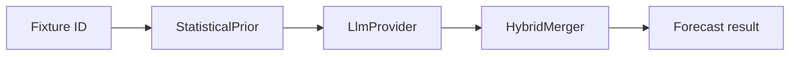

# WC2026 AI Hybrid Forecaster

LLM-first TypeScript forecaster for FIFA World Cup 2026 — async provider pipeline that blends AI narrative analysis with statistical priors. Supports mock analyst (offline) and OpenAI-compatible live endpoints.

## Features

- **Provider pipeline** — pluggable `LlmProvider` with `MockAnalyst` and `OpenAiAnalyst`
- **Statistical priors** — Elo-based baseline probabilities before AI adjustment
- **Hybrid merger** — configurable blend weight between stats and LLM output
- **Batch forecasting** — `ForecastPipeline` processes multiple fixtures concurrently
- **Prompt templates** — structured JSON parsing from model responses
- **Redis cache** — optional caching for forecast batches

## Quick start

**Requirements:** Node.js 20+

```bash
npm install
npm test
npm run forecast -- ask A1          # mock AI (no key)
npm run forecast -- batch
```

### Live AI

```bash
cp .env.example .env
# Set OPENAI_API_KEY and optionally AI_BASE_URL
npm run forecast -- ask A1
```

## Architecture

```
world-cup-2026-ai-hybrid-predictor/
├── src/
│   ├── bin/forecaster.ts       CLI entry
│   ├── providers/              LlmProvider, MockAnalyst, OpenAiAnalyst
│   ├── prompts/                System prompts, JSON response parsing
│   ├── fusion/                 StatisticalPrior + HybridMerger
│   ├── pipeline/               ForecastPipeline (async batch)
│   ├── registry/               Schedule + Elo lookup tables
│   ├── interfaces/             Forecast & fixture contracts
│   ├── config/                 AI_SETTINGS from environment
│   └── utils/                  Redis cache layer
└── tests/
```

### Forecast flow



## CLI reference

| Command | Description |
|---------|-------------|
| `ask <fixtureId>` | Single-fixture hybrid forecast |
| `batch` | Run pipeline across scheduled fixtures |
| `redis ping` | Redis health check |
| `redis flush` | Clear forecast cache |

### Examples

```bash
npm run forecast -- ask A1
npm run forecast -- ask B2 --no-cache
npm run forecast -- batch
```

## Environment variables

| Variable | Default | Description |
|----------|---------|-------------|
| `OPENAI_API_KEY` | — | Required for live AI (not mock) |
| `AI_BASE_URL` | OpenAI | Compatible API endpoint |
| `AI_MODEL` | `gpt-4o-mini` | Model slug |
| `AI_BLEND_WEIGHT` | `0.3` | AI weight in hybrid (stats = 1 − weight) |
| `REDIS_URL` | — | Optional forecast cache |

## Library API

```typescript
import { ForecastPipeline } from "./src/pipeline/ForecastPipeline.js";
import { MockAnalyst } from "./src/providers/MockAnalyst.js";
import { HybridMerger } from "./src/fusion/HybridMerger.js";

const pipeline = new ForecastPipeline({ provider: new MockAnalyst() });
const forecast = await pipeline.forecastFixture("A1");
console.log(forecast);
```

## Scripts

| Script | Description |
|--------|-------------|
| `npm run forecast` | CLI |
| `npm run typecheck` | TypeScript check |
| `npm test` | Vitest |

## Mock vs live AI

| Mode | API key | Command |
|------|---------|---------|
| Mock analyst | Not required | `npm run forecast -- ask A1` |
| Live OpenAI | `OPENAI_API_KEY` | Same command with `.env` configured |
